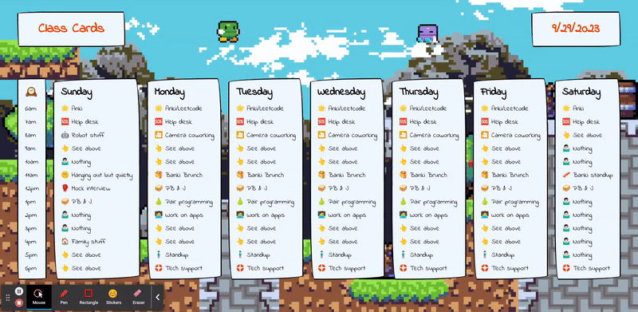

# Class Cards
A weekly schedule with a hand drawn look over pixel graphics.



## How It's Made:

**Tech used:** TypeScript, Next.js with Styled-Components

## TODO:

- Add ability to edit schedule and store data in local storage
- Optimize the site for mobile display
- Add the ability to actually host and run the thing outside of localhost

## Original concept art:


## How to run Class Cards locally:

1. **Fork and Clone the Repository:**
   - First, fork the repository on GitHub if you haven't already.
   - Then, clone the forked repository to your local environment using the following command:
     ```
     git clone <repository_url>
     ```
   - Replace `<repository_url>` with the URL of your forked repository.

1. **Install Dependencies:**
   - Open your terminal and navigate to the project's directory using `cd <project_directory>`.
   - Run the following command to install the project's dependencies:
     ```
     npm install
     ```

1. **Run the Application:**
   - Once the dependencies are installed, you can start the development server by running:
     ```
     npm run dev
     ```
   - This command will build and run Class Cards locally.

1. **View Your App:**
   - Open your web browser and go to the following address:
     ```
     http://localhost:3000
     ```
   - This is where your locally running Next.js app can be accessed.

1. **Access Schedule Data:**
   - If you need to access schedule data, it's located in the following file:
     ```
     src/app/data/seedData.tsx
     ```
   - You can edit or view the schedule data in this file as needed.
