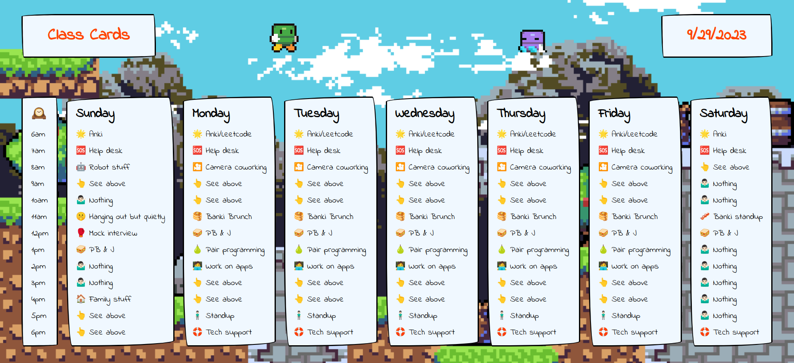
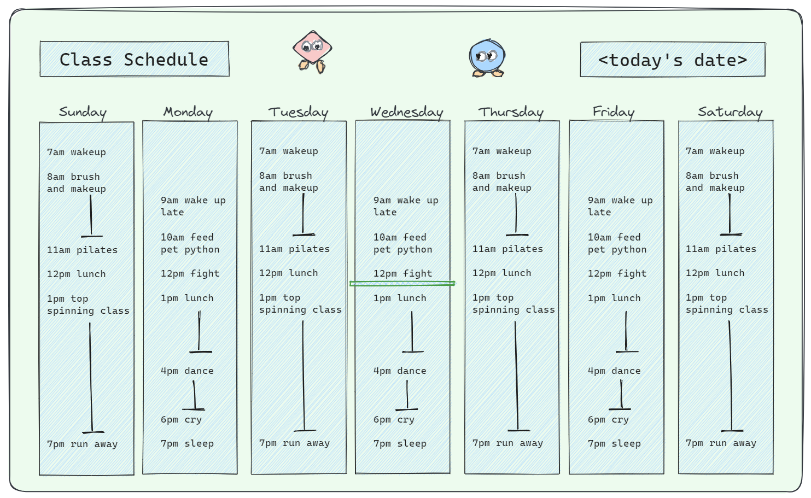

# Class Cards
A weekly schedule with a handdrawn look and pixel graphics.

## How It's Made:

**Tech used:** TypeScript, Next.js with Styled-Components

## TODO:

- Add ability to edit schedule and store data in local storage
- Optimize site for mobile display

## Original concept art:
